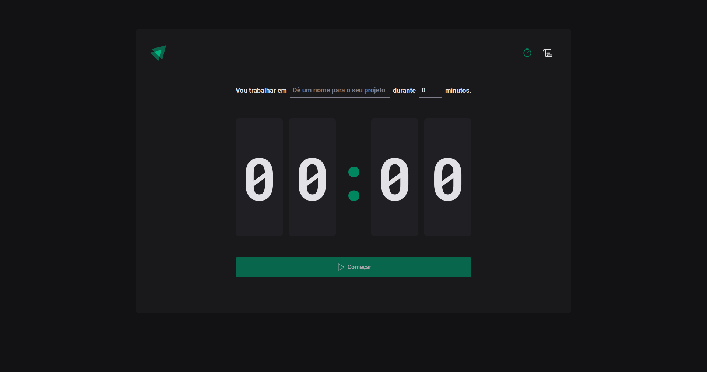

<h1 align="center"> Ignite pomodoro </h1>

 projeto da rocketseat proposto no curso do Ignite

  <a href="#-tecnologias">Tecnologias</a>&nbsp;&nbsp;&nbsp;|&nbsp;&nbsp;&nbsp;
  <a href="#-projeto">Projeto</a>&nbsp;&nbsp;&nbsp;|&nbsp;&nbsp;&nbsp;
  <a href="#-layout">Layout</a>&nbsp;&nbsp;&nbsp;|&nbsp;&nbsp;&nbsp;
  <a href="#memo-licença">Licença</a>

  

 

  

## 🚀 Tecnologias

Esse projeto foi desenvolvido com as seguintes tecnologias:

- Vite
- React
- TypeScript
- Styled-components
- Git
- Github

## 💻 Projeto

Um sistema de pomodoro, com tela do pomodoro e tela de listagem dos pomodoros criados, juntamente com os status de cada um.

## 🔖 Layout

Você pode visualizar o layout do projeto através [DESSE LINK](https://www.figma.com/community/file/1127351821076435124).

## :memo: Licença

Esse projeto está sob a licença MIT.

---

Projeto proposto pela Rocketseat  
by Matheus Ramalho - [matheusramalho.dev](matheusramalho.dev)
